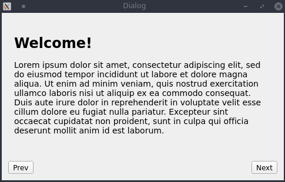
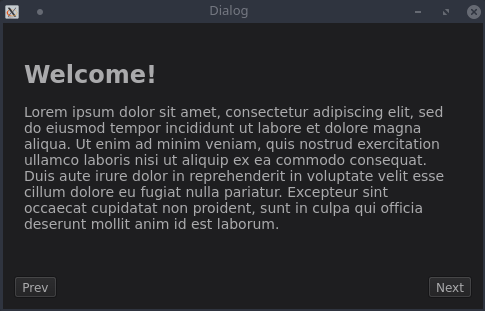

# SlidingStackedWidget

This is a Improved version of [Tim Schneeberger's](https://github.com/ThePBone/) SlidingStackedWidget which is also an extended version of QStackedWidget for Qt. Check `slidingstackedwidget.h` for a simple API reference. This code is based on an older [wiki post](https://qt.shoutwiki.com/wiki/Extending_QStackedWidget_for_sliding_page_animations_in_Qt) for Symbian devices.

### Improvements 

* The new SlidingStackedWidget class in this repo is able to handle nested SlidingStackedWidget. (The issue with Tim Schneeberger's was, that if you will use multiple instance of widget based on SlidingStackedWidget class. The QPainter would throw tons of errors most critical one was about more than one painter instances painting the widget at a time. This was fixed by properly deleting the used Painter used by QGraphicsOpacityEffect class).

* Made the slideInWgt function public so, you can now switch pages or widget by calling slideInWgt(QWidget * widget).

* Other performance improvements and memory footprint optimizations. 

### Usage

#### Include it in your project

Copy the `SlidingStackedWidget` subdirectory from this repository into your project folder and add this to your qmake project file:

```cmake
include(SlidingStackedWidget/SlidingStackedWidget.pri)
```

### Screenshots

Default animation duration (300ms):



Slow-motion (3000ms):



As you can see, the page is slowly fading in/out in addition to the sliding animation.
